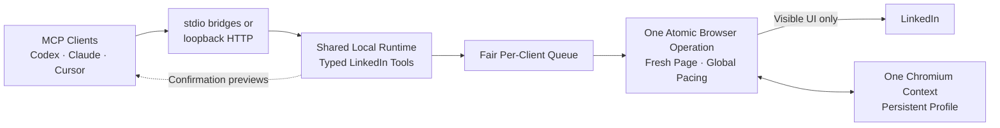

# LinkedIn MCP Server

<!-- mcp-name: io.github.prakharagarwal-dev/linkedin-mcp-server -->

[](https://github.com/prakharagarwal-dev/linkedin-mcp-server/actions/workflows/ci.yml)
[](https://github.com/prakharagarwal-dev/linkedin-mcp-server/actions/workflows/codeql.yml)
[](https://pypi.org/project/linkedin-mcp-local/)
[](https://www.python.org/)
[](LICENSE)

> **Disclaimer:** LinkedIn is a registered trademark of LinkedIn Corporation
> and its affiliates. LinkedIn MCP Server is an independent, unofficial project
> and is not affiliated with, endorsed by, sponsored by, or associated with
> LinkedIn Corporation or its affiliates.

A LinkedIn MCP server to find jobs, search people, research companies, manage
your network, publish and engage with posts, and read or send messages.

## Features

| Area | Function | MCP tool(s) | What it does |
| --- | --- | --- | --- |
| **Jobs** | Search jobs | `linkedin.jobs.search` | Search by keywords, location, distance, date, workplace, experience, employment type, company, industry, function, title, benefits, Easy Apply, verification, applicant count, network, and other visible filters. |
|  | Read job details | `linkedin.jobs.get` | Read the complete job description, company, application method, and visible hiring team. |
| **People** | Search people | `linkedin.people.search` | Search by keywords, connection degree, hiring status, location, current or past company, title, school, industry, services, language, connections, and followers. |
|  | Read profiles | `linkedin.people.get` | Read the complete visible profile or request selected sections such as About, experience, education, skills, projects, certifications, and recommendations. |
| **Companies** | Search companies | `linkedin.companies.search` | Search by keywords, headquarters, industry, size, available jobs, and first-degree connections. |
|  | Read company details | `linkedin.companies.get` | Read Overview and About information, including website, headquarters, size, type, founding year, and specialties. |
| **Posts** | Search posts | `linkedin.posts.search` | Search by keywords, date, content type, author, company, relationship, mentions, author industry, and other visible filters. |
|  | Read posts | `linkedin.posts.get` | Read complete content, media, links, mentions, hashtags, reactions, and engagement. |
|  | Read discussions | `linkedin.posts.comments.list` | Read paginated comments, replies, attachments, and reactions. |
|  | Publish posts | `linkedin.posts.create.prepare`<br>`linkedin.posts.create.execute` | Publish supported personal text, link, image, video, document, poll, celebration, event, hiring, and expert-request posts. |
|  | Comment | `linkedin.posts.comment.prepare`<br>`linkedin.posts.comment.execute` | Add text, links, emoji, mentions, photos, or GIFs to posts. |
|  | React | `linkedin.posts.reaction.prepare`<br>`linkedin.posts.reaction.execute` | Add, change, or remove reactions on posts. |
| **Network** | List connections | `linkedin.connections.list` | Browse established first-degree connections with sorting and pagination. |
|  | Search connections | `linkedin.connections.search` | Search existing connections using applicable People filters. |
|  | List invitations | `linkedin.invitations.list` | Browse received and sent invitations using LinkedIn's visible filters. |
|  | Send invitations | `linkedin.invitations.send.prepare`<br>`linkedin.invitations.send.execute` | Send connection requests with optional notes. |
|  | Accept invitations | `linkedin.invitations.accept.prepare`<br>`linkedin.invitations.accept.execute` | Accept incoming connection requests. |
|  | Ignore invitations | `linkedin.invitations.ignore.prepare`<br>`linkedin.invitations.ignore.execute` | Ignore incoming connection requests. |
| **Messaging** | Search messages | `linkedin.messaging.search` | Search by recipient or message text using inbox categories and filters. |
|  | Read conversations | `linkedin.messaging.conversation.get` | Read message history, replies, edits, reactions, and attachments. |
|  | Send messages | `linkedin.messaging.message.prepare`<br>`linkedin.messaging.message.execute` | Send or reply in one-to-one conversations with text, links, emoji, files, images, and GIFs. |
| **Server** | Check runtime | `linkedin.server.status` | Inspect the shared runtime, queue, and active browser operation. |
|  | Check LinkedIn session | `linkedin.session.status` | Inspect browser-profile, authentication, login, and pause state. |
|  | List capabilities | `linkedin.capabilities.list` | Inspect available capabilities, scopes, and enabled state. |

Actions that change LinkedIn use an immutable prepare-and-execute flow and
request confirmation by default. Every capability is task-specific; the server
does not expose unrestricted browser, click, navigation, JavaScript, or network
access.

See the [capability matrix](docs/CAPABILITY_MATRIX.md) for exact filters,
supported formats, inputs, outputs, limits, and unsupported features.

## Installation

<details open>
<summary>VS Code and GitHub Copilot</summary>

[](https://insiders.vscode.dev/redirect?url=vscode%3Amcp%2Finstall%3F%257B%2522name%2522%253A%2522linkedin-mcp%2522%252C%2522command%2522%253A%2522uvx%2522%252C%2522args%2522%253A%255B%2522--from%2522%252C%2522linkedin-mcp-local%2522%252C%2522linkedin-mcp%2522%252C%2522serve%2522%252C%2522--transport%2522%252C%2522stdio%2522%255D%257D)
[](https://insiders.vscode.dev/redirect?url=vscode-insiders%3Amcp%2Finstall%3F%257B%2522name%2522%253A%2522linkedin-mcp%2522%252C%2522command%2522%253A%2522uvx%2522%252C%2522args%2522%253A%255B%2522--from%2522%252C%2522linkedin-mcp-local%2522%252C%2522linkedin-mcp%2522%252C%2522serve%2522%252C%2522--transport%2522%252C%2522stdio%2522%255D%257D)

Or add this to `.vscode/mcp.json`:

```json
{
  "servers": {
    "linkedin-mcp": {
      "command": "uvx",
      "args": ["--from", "linkedin-mcp-local", "linkedin-mcp", "serve", "--transport", "stdio"]
    }
  }
}
```

See the [VS Code MCP documentation](https://code.visualstudio.com/docs/agent-customization/mcp-servers).

</details>

<details>
<summary>Codex and ChatGPT Desktop</summary>

Add this to `~/.codex/config.toml`:

```toml
[mcp_servers."linkedin-mcp"]
command = "uvx"
args = ["--from", "linkedin-mcp-local", "linkedin-mcp", "serve", "--transport", "stdio"]
startup_timeout_sec = 60
tool_timeout_sec = 900
default_tools_approval_mode = "auto"
```

Codex CLI, the Codex IDE extension, and ChatGPT Desktop share this local
configuration. Restart the client after saving it. See the
[Codex MCP documentation](https://learn.chatgpt.com/docs/extend/mcp).

</details>

<details>
<summary>Claude Code</summary>

```bash
claude mcp add --scope user --transport stdio linkedin-mcp -- \
  uvx --from linkedin-mcp-local linkedin-mcp serve --transport stdio
```

Check it with `claude mcp list`. See the
[Claude Code MCP documentation](https://code.claude.com/docs/en/mcp).

</details>

<details>
<summary>Claude Desktop</summary>

[](https://github.com/prakharagarwal-dev/linkedin-mcp-server/releases/latest)

Download the `.mcpb` file, then open **Settings → Extensions → Advanced
settings → Install Extension**.
See [Claude Desktop's extension documentation](https://support.claude.com/en/articles/10949351-getting-started-with-local-mcp-servers-on-claude-desktop).

</details>

<details>
<summary>Cursor</summary>

[](https://cursor.com/en/install-mcp?name=LinkedIn%20MCP&config=eyJjb21tYW5kIjoidXZ4IC0tZnJvbSBsaW5rZWRpbi1tY3AtbG9jYWwgbGlua2VkaW4tbWNwIHNlcnZlIC0tdHJhbnNwb3J0IHN0ZGlvIn0%3D)

For manual setup, open **Cursor Settings → MCP →
Add new MCP server**, set the command to `uvx`, and set the arguments to
`--from linkedin-mcp-local linkedin-mcp serve --transport stdio`.
See the [Cursor MCP documentation](https://docs.cursor.com/en/tools/mcp).

</details>

<details>
<summary>Gemini CLI</summary>

In `~/.gemini/settings.json`, add a local server named `linkedin-mcp` under
`mcpServers` with command `uvx` and arguments
`--from linkedin-mcp-local linkedin-mcp serve --transport stdio`, then run
`gemini mcp list`.
See the [Gemini CLI MCP documentation](https://github.com/google-gemini/gemini-cli/blob/main/docs/tools/mcp-server.md).

</details>

<details>
<summary>Windsurf</summary>

Open **Settings → AI → Manage MCP Servers**, or add a local server named
`linkedin-mcp` to `~/.codeium/windsurf/mcp_config.json` with command `uvx` and
arguments `--from linkedin-mcp-local linkedin-mcp serve --transport stdio`.
See the [Windsurf MCP documentation](https://docs.windsurf.com/windsurf/cascade/mcp).

</details>

<details>
<summary>Cline</summary>

Open **MCP Servers → Configure**, then add a local server named `linkedin-mcp`
with command `uvx` and arguments
`--from linkedin-mcp-local linkedin-mcp serve --transport stdio`.
See the [Cline MCP documentation](https://docs.cline.bot/mcp/mcp-overview).

</details>

<details>
<summary>Roo Code</summary>

Open Roo Code's MCP settings and add a local server named `linkedin-mcp` to the
global file or `.roo/mcp.json`, using command `uvx` and arguments
`--from linkedin-mcp-local linkedin-mcp serve --transport stdio`.
See the [Roo Code MCP documentation](https://docs.roocode.com/features/mcp/using-mcp-in-roo).

</details>

<details>
<summary>Kiro</summary>

[](https://kiro.dev/launch/mcp/add?name=linkedin-mcp&config=%7B%22command%22%3A%22uvx%22%2C%22args%22%3A%5B%22--from%22%2C%22linkedin-mcp-local%22%2C%22linkedin-mcp%22%2C%22serve%22%2C%22--transport%22%2C%22stdio%22%5D%7D)

Or add a local server named `linkedin-mcp` to
`~/.kiro/settings/mcp.json` with command `uvx` and arguments
`--from linkedin-mcp-local linkedin-mcp serve --transport stdio`.
See the [Kiro MCP documentation](https://kiro.dev/docs/mcp/configuration/).

</details>

<details>
<summary>Zed</summary>

Add this to Zed settings:

```json
{
  "context_servers": {
    "linkedin-mcp": {
      "command": "uvx",
      "args": ["--from", "linkedin-mcp-local", "linkedin-mcp", "serve", "--transport", "stdio"]
    }
  }
}
```

See the [Zed MCP documentation](https://zed.dev/docs/ai/mcp).

</details>

<details>
<summary>LM Studio</summary>

[](https://lmstudio.ai/install-mcp?name=linkedin-mcp&config=eyJjb21tYW5kIjoidXZ4IiwiYXJncyI6WyItLWZyb20iLCJsaW5rZWRpbi1tY3AtbG9jYWwiLCJsaW5rZWRpbi1tY3AiLCJzZXJ2ZSIsIi0tdHJhbnNwb3J0Iiwic3RkaW8iXX0%3D)

Or open **Program → Install → Edit mcp.json** and
add a local server named `linkedin-mcp` with command `uvx` and arguments
`--from linkedin-mcp-local linkedin-mcp serve --transport stdio`.
See the [LM Studio MCP documentation](https://lmstudio.ai/docs/app/mcp).

</details>

<details>
<summary>Goose</summary>

[](https://block.github.io/goose/extension?cmd=uvx&arg=--from&arg=linkedin-mcp-local&arg=linkedin-mcp&arg=serve&arg=--transport&arg=stdio&id=linkedin-mcp&name=LinkedIn%20MCP&description=Search%20LinkedIn%20jobs%2C%20people%2C%20companies%2C%20posts%2C%20connections%2C%20and%20messages)

Or add a custom stdio extension with command `uvx` and arguments
`--from linkedin-mcp-local linkedin-mcp serve --transport stdio`, or start one
CLI session with:

```bash
goose session --with-extension \
  "uvx --from linkedin-mcp-local linkedin-mcp serve --transport stdio"
```

See the [Goose documentation](https://block.github.io/goose/).

</details>

<details>
<summary>OpenCode</summary>

For OpenCode v2, add this to `opencode.json`:

```json
{
  "$schema": "https://opencode.ai/config.json",
  "mcp": {
    "servers": {
      "linkedin-mcp": {
        "type": "local",
        "command": ["uvx", "--from", "linkedin-mcp-local", "linkedin-mcp", "serve", "--transport", "stdio"]
      }
    }
  }
}
```

See the [OpenCode MCP documentation](https://opencode.ai/v2/docs/mcp-servers).

</details>

<details>
<summary>JetBrains AI Assistant</summary>

Open **Settings → Tools → AI Assistant → Model Context Protocol (MCP)**, click
**Add**, set the command to `uvx`, and set the arguments to
`--from linkedin-mcp-local linkedin-mcp serve --transport stdio`.
See the [JetBrains MCP documentation](https://www.jetbrains.com/help/ai-assistant/mcp.html).

</details>

<details>
<summary>Continue</summary>

Create `.continue/mcpServers/linkedin-mcp.json` with a local server named
`linkedin-mcp`, command `uvx`, and arguments
`--from linkedin-mcp-local linkedin-mcp serve --transport stdio`.
See the [Continue MCP documentation](https://docs.continue.dev/customize/deep-dives/mcp).

</details>

<details>
<summary>Warp</summary>

Open **Settings → AI → Manage MCP Servers → Add**, name the server
`linkedin-mcp`, set the command to `uvx`, and set the arguments to
`--from linkedin-mcp-local linkedin-mcp serve --transport stdio`.
See the [Warp MCP documentation](https://docs.warp.dev/agent-platform/capabilities/mcp).

</details>

## Usage

### First-time LinkedIn login

After installation, restart your MCP client. The server opens LinkedIn in a
browser window where you can sign in and complete MFA or any checkpoint. On
this first use it creates its own persistent Chromium profile automatically.
Your session is saved in that profile and reused across restarts.

If you have not started the server yet and want to log in manually, create the
dedicated profile first:

```bash
uvx --from linkedin-mcp-local linkedin-mcp profile create
uvx --from linkedin-mcp-local linkedin-mcp login
```

The server never asks for or stores your LinkedIn password.

### Local session controls

Use these commands without locating PIDs or deleting lock files manually:

```bash
# Show or gracefully stop the process that owns this account
uvx --from linkedin-mcp-local linkedin-mcp status
uvx --from linkedin-mcp-local linkedin-mcp stop

# Inspect the dedicated Chromium profile or sign out visibly
uvx --from linkedin-mcp-local linkedin-mcp profile status
uvx --from linkedin-mcp-local linkedin-mcp logout
```

For a clean profile, run `linkedin-mcp profile reset`. The command asks for
confirmation, archives the old profile, and creates a replacement. See
[Configuration](docs/CONFIGURATION.md#browser-profile-and-linkedin-session)
for the complete lifecycle.

### Try it

Ask your MCP client naturally:

**Find jobs**

> Find remote software engineering jobs in India posted this week with Easy Apply.

**Research people**

> Find engineering managers at Stripe in India and show me their relevant experience.

**Research companies**

> Find fintech companies in Bengaluru with 51–200 employees and summarize each company.

**Explore posts**

> Find recent LinkedIn posts about AI agents and summarize the most useful discussions.

**Manage your network**

> Show my latest received connection requests.

> Send a connection request to `<profile URL>` with the note `<note>`.

**Send messages**

> Send `<message>` to `<profile URL>`.

### Approval modes

Account-changing execute tools request confirmation by default. Approval is a
setting of the MCP client, not something an agent can grant itself. To let a
Codex scheduled task publish posts unattended while every other LinkedIn action
keeps its default behavior, add this explicit per-tool approval:

```toml
[mcp_servers."linkedin-mcp".tools."linkedin.posts.create.execute"]
approval_mode = "approve"
```

Restart Codex after changing its configuration. The post still goes through the
same immutable draft, scope, payload-hash, idempotency, identity, and visible
postcondition checks. Avoid approving the entire server when only one action is
needed. See [Configuration](docs/CONFIGURATION.md#client-approval-policy) for
the full policy model.

## Architecture



Everything runs locally. There is no hosted backend, telemetry, database,
external queue, LangGraph runtime, or credential service. Browser cookies live
only in the local Playwright profile. The first client starts one shared local
runtime; later clients attach to it, and fair scheduling gives each client a
turn between complete tool calls. Operation state lasts only for that runtime.
Read the full [architecture](docs/ARCHITECTURE.md) and [privacy policy](PRIVACY.md).

## Configuration

Common settings control:

- enabled LinkedIn surfaces, capability scopes, and effect classes;
- client-side interactive or explicit per-tool approval behavior;
- the persistent browser profile and headed/headless operation;
- the local attachment directory;
- internal pacing, queue capacity, and bounded collection traversal; and
- stdio or loopback-only Streamable HTTP transport.

See [Configuration](docs/CONFIGURATION.md) for ready-made permission presets,
every environment variable, local HTTP sharing, and the container image.

## Privacy Policy

The server has no maintainer-operated backend, analytics, advertising, or
telemetry. LinkedIn receives normal visible-UI requests, and the invoking MCP
client receives tool results under its own data policy; the project sends
nothing to the maintainer. Read the complete [privacy policy](PRIVACY.md) for
processing, storage, sharing, retention, and deletion details.

## Safety

Use of this software is at your own risk. You are solely responsible for
complying with [LinkedIn's User Agreement](https://www.linkedin.com/legal/user-agreement),
applicable laws, and third-party rights. LinkedIn may limit or restrict accounts
that use [prohibited automation](https://www.linkedin.com/help/linkedin/answer/a1341387/).
The maintainers do not authorize spam, unauthorized data collection, privacy
violations, or circumvention of access controls.

- Use only accounts and activity you are authorized to operate.
- The server pauses on authentication expiry, checkpoints, restriction pages,
  permission failures, and configuration errors.
- It does not implement CAPTCHA bypass, proxy rotation, fingerprint spoofing,
  credential harvesting, stealth plugins, or private LinkedIn endpoints.
- Never commit or share the persistent browser profile or local assets.

See [SECURITY.md](SECURITY.md) and [the security design](docs/SECURITY.md).

## More documentation

- [Configuration](docs/CONFIGURATION.md)
- [Capability matrix](docs/CAPABILITY_MATRIX.md)
- [Architecture](docs/ARCHITECTURE.md)
- [Testing](docs/TESTING.md)
- [Collection verification](docs/COLLECTION_VERIFICATION_PROCESS.md)
- [Publishing](docs/PUBLISHING.md)
- [Changelog](CHANGELOG.md)

## Support the project

If LinkedIn MCP Server is useful to you:

- [Star the repository](https://github.com/prakharagarwal-dev/linkedin-mcp-server)
- [Sponsor continued development](https://github.com/sponsors/prakharagarwal-dev)

## Let's connect

Have feedback or an idea for LinkedIn MCP Server?

- [Connect with me on LinkedIn](https://www.linkedin.com/in/prakhar-agarwal-byte/)
- [Follow me on GitHub](https://github.com/prakharagarwal-dev)
- [Report a bug or request a feature](https://github.com/prakharagarwal-dev/linkedin-mcp-server/issues)

## License

Licensed under the [Apache License 2.0](LICENSE).
