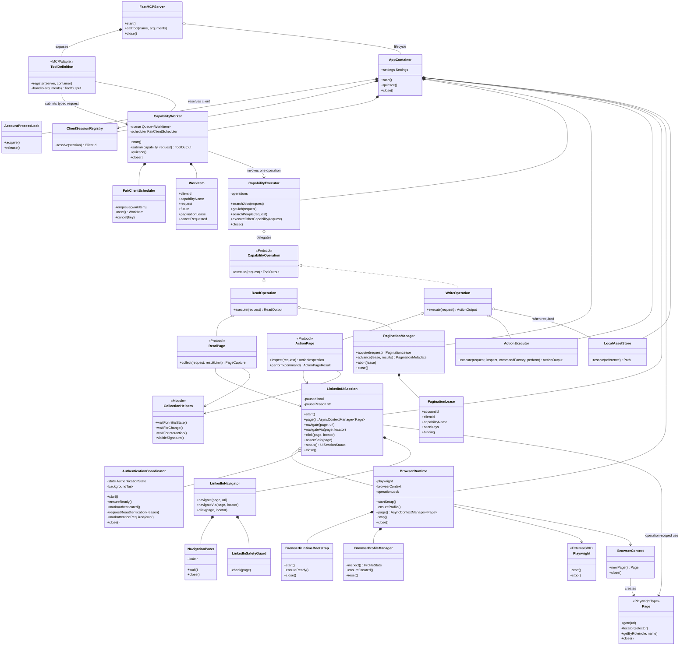
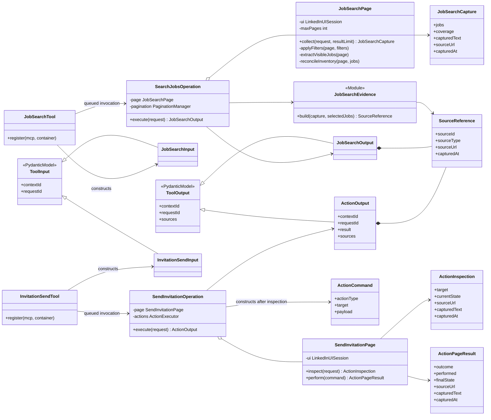
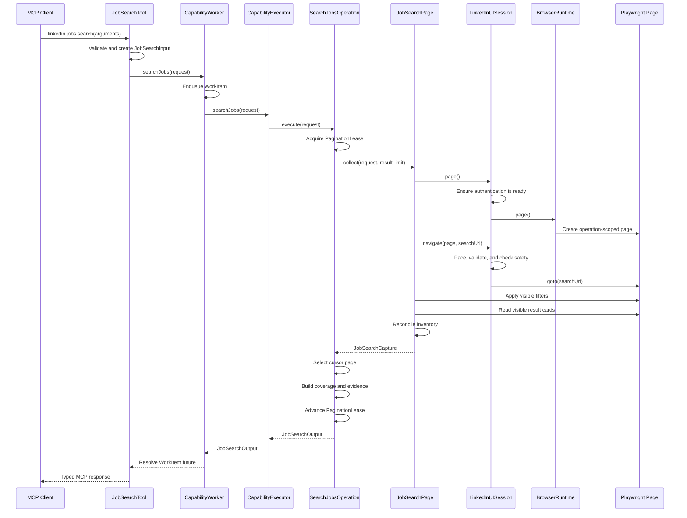
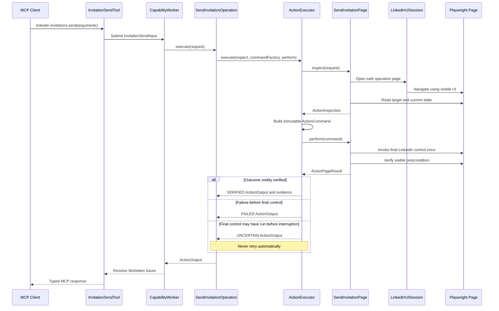
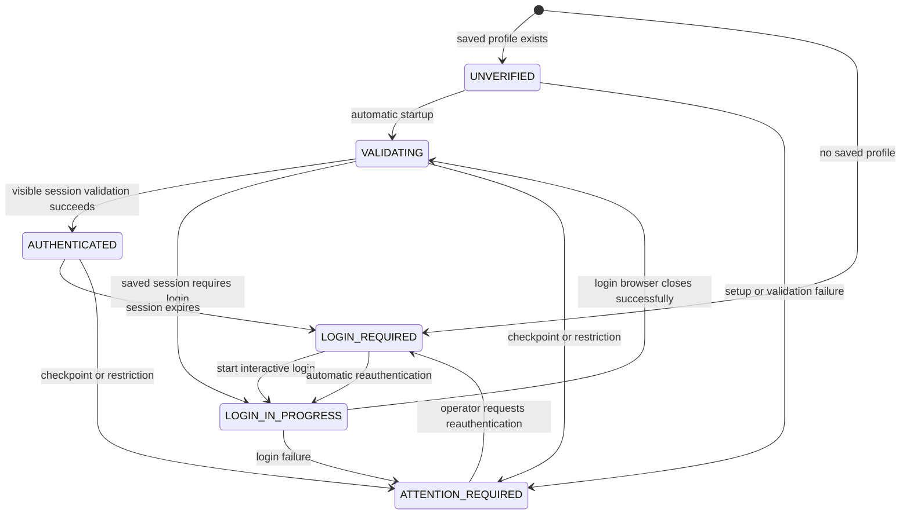

# Low-Level Design

## Status

This document describes the proposed target design for separating MCP wiring,
application orchestration, LinkedIn UI automation, browser mechanics, and
capability-owned code. It is an implementation design, not a description of
the current package layout.

In the diagrams:

- `*--` means lifecycle ownership;
- `o--` means an injected dependency;
- `-->` means a call or other use; and
- `..|>` means that a concrete class implements a protocol.

## Core classes



## Capability classes

Every capability follows the same vertical-slice pattern. Job search represents
a read capability, while invitation send represents an account-changing
capability.



## Read interaction



## Write interaction



## Authentication states



## Dependency direction

```text
MCP tool
    -> capability worker
        -> capability executor
            -> capability operation
                -> capability page object
                    -> LinkedIn UI session
                        -> browser runtime
                            -> Playwright
```

Capability page objects never own a browser or retain a Playwright `Page`.
They receive `LinkedInUISession`, use an operation-scoped page, and return typed
captures. `LinkedInUISession` owns LinkedIn-wide automation behavior, while
`BrowserRuntime` remains a low-level Playwright resource manager.
